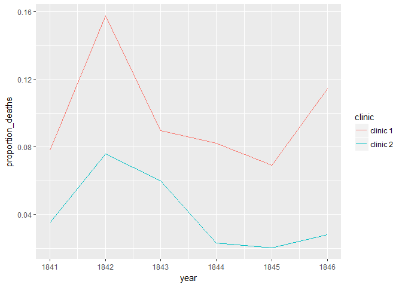
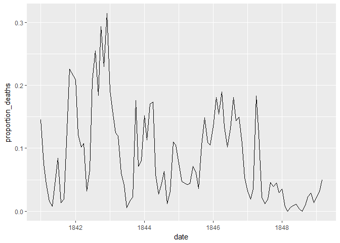
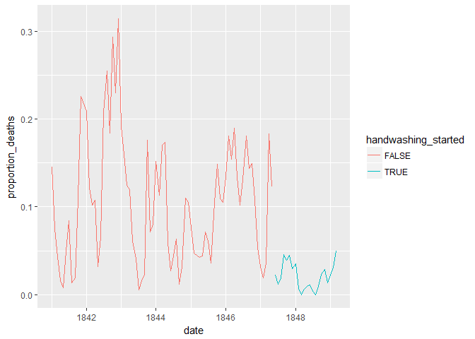

# Dr. Semmelweis and the discovery of handwashing

This repository aims to provide a reference of work on the project *Dr. Semmelweis and the discovery of handwashing* to other users of [DataCamp](https://www.datacamp.com/home). Plots and images can be found under directory **Semmelweis_files**.

## Project Flow:

<br/> [1. Meet Dr. Ignaz Semmelweis](#meet-dr-ignaz-semmelweis) <br/> [2. The alarming number of deaths](#the-alarming-number-of-deaths) <br/> [3. Death at the clinics](#death-at-the-clinics) <br/> [4. The handwashing begins](#the-handwashing-begins) <br/> [5. The effect of handwashing](#the-effect-of-handwashing) <br/> [6. The effect of handwashing highlighted](#the-effect-of-handwashing-highlighted) <br/> [7. More handwashing, fewer deaths?](#more-handwashing-fewer-deaths) <br/> [8. A statistical analysis of Semmelweis handwashing data](#a-statistical-analysis-of-semmelweis-handwashing-data) <br/> [9. The fate of Dr. Semmelweis](#the-fate-of-dr-semmelweis)

### 1. Meet Dr Ignaz Semmelweis
---------------------------


This is Dr. Ignaz Semmelweis, a Hungarian physician born in 1818 and active at the Vienna General Hospital. If Dr. Semmelweis looks troubled it's probably because he's thinking about childbed fever: A deadly disease affecting women that just have given birth. He is thinking about it because in the early 1840s at the Vienna General Hospital as many as 10% of the women giving birth die from it. He is thinking about it because he knows the cause of childbed fever: It's the contaminated hands of the doctors delivering the babies. And they won't listen to him and wash their hands!

In this notebook, we're going to reanalyze the data that made Semmelweis discover the importance of handwashing. Let's start by looking at the data that made Semmelweis realize that something was wrong with the procedures at Vienna General Hospital.

``` r
# Load in the tidyverse package
library(tidyverse)

# Read datasets/yearly_deaths_by_clinic.csv into yearly
yearly <- read_csv("datasets/yearly_deaths_by_clinic.csv")

# Print out yearly
yearly
```

    ## # A tibble: 12 x 4
    ##     year births deaths clinic  
    ##    <int>  <int>  <int> <chr>   
    ##  1  1841   3036    237 clinic 1
    ##  2  1842   3287    518 clinic 1
    ##  3  1843   3060    274 clinic 1
    ##  4  1844   3157    260 clinic 1
    ##  5  1845   3492    241 clinic 1
    ##  6  1846   4010    459 clinic 1
    ##  7  1841   2442     86 clinic 2
    ##  8  1842   2659    202 clinic 2
    ##  9  1843   2739    164 clinic 2
    ## 10  1844   2956     68 clinic 2
    ## 11  1845   3241     66 clinic 2
    ## 12  1846   3754    105 clinic 2

### 2. The alarming number of deaths
--------------------------------

The table above shows the number of women giving birth at the two clinics at the Vienna General Hospital for the years 1841 to 1846. You'll notice that giving birth was very dangerous; an alarming number of women died as the result of childbirth, most of them from childbed fever.

We see this more clearly if we look at the proportion of deaths out of the number of women giving birth.

``` r
# Adding a new column to yearly with proportion of deaths per no. births
yearly <- yearly %>%
  mutate(proportion_deaths = deaths/births)

# Print out yearly
yearly
```

    ## # A tibble: 12 x 5
    ##     year births deaths clinic   proportion_deaths
    ##    <int>  <int>  <int> <chr>                <dbl>
    ##  1  1841   3036    237 clinic 1            0.0781
    ##  2  1842   3287    518 clinic 1            0.158 
    ##  3  1843   3060    274 clinic 1            0.0895
    ##  4  1844   3157    260 clinic 1            0.0824
    ##  5  1845   3492    241 clinic 1            0.0690
    ##  6  1846   4010    459 clinic 1            0.114 
    ##  7  1841   2442     86 clinic 2            0.0352
    ##  8  1842   2659    202 clinic 2            0.0760
    ##  9  1843   2739    164 clinic 2            0.0599
    ## 10  1844   2956     68 clinic 2            0.0230
    ## 11  1845   3241     66 clinic 2            0.0204
    ## 12  1846   3754    105 clinic 2            0.0280

### 3. Death at the clinics
-----------------------

If we now plot the proportion of deaths at both clinic 1 and clinic 2 we'll see a curious pattern...

``` r
# Setting the size of plots in this notebook
options(repr.plot.width=7, repr.plot.height=4)

# Plot yearly proportion of deaths at the two clinics
ggplot(yearly, aes(year, proportion_deaths, col = clinic)) + geom_line()
```



### 4. The handwashing begins
-------------------------

Why is the proportion of deaths constantly so much higher in Clinic 1? Semmelweis saw the same pattern and was puzzled and distressed. The only difference between the clinics was that many medical students served at Clinic 1, while mostly midwife students served at Clinic 2. While the midwives only tended to the women giving birth, the medical students also spent time in the autopsy rooms examining corpses.

Semmelweis started to suspect that something on the corpses, spread from the hands of the medical students, caused childbed fever. So in a desperate attempt to stop the high mortality rates, he decreed: Wash your hands! This was an unorthodox and controversial request, nobody in Vienna knew about bacteria at this point in time.

Let's load in monthly data from Clinic 1 to see if the handwashing had any effect.

``` r
# Read datasets/monthly_deaths.csv into monthly
monthly <- read_csv("datasets/monthly_deaths.csv")

# Adding a new column with proportion of deaths per no. births
monthly <- monthly %>%
mutate(proportion_deaths = deaths/births)

# Print out the first rows in monthly
head(monthly)
```

    ## # A tibble: 6 x 4
    ##   date       births deaths proportion_deaths
    ##   <date>      <int>  <int>             <dbl>
    ## 1 1841-01-01    254     37           0.146  
    ## 2 1841-02-01    239     18           0.0753 
    ## 3 1841-03-01    277     12           0.0433 
    ## 4 1841-04-01    255      4           0.0157 
    ## 5 1841-05-01    255      2           0.00784
    ## 6 1841-06-01    200     10           0.0500

### 5. The effect of handwashing
----------------------------

With the data loaded we can now look at the proportion of deaths over time. In the plot below we haven't marked where obligatory handwashing started, but it reduced the proportion of deaths to such a degree that you should be able to spot it!

``` r
# Plot monthly proportion of deaths
ggplot(monthly, aes(date, proportion_deaths)) + geom_line()
```



### 6. The effect of handwashing highlighted
----------------------------------------

Starting from the summer of 1847 the proportion of deaths is drastically reduced and, yes, this was when Semmelweis made handwashing obligatory.

The effect of handwashing is made even more clear if we highlight this in the graph.

``` r
# From this date handwashing was made mandatory
handwashing_start = as.Date('1847-06-01')

# Add a TRUE/FALSE column to monthly called handwashing_started
monthly <- monthly %>%
mutate(handwashing_started = date >= handwashing_start)

# Plot monthly proportion of deaths before and after handwashing
ggplot(monthly, aes(date, proportion_deaths, col = handwashing_started)) + geom_line()
```



### 7. More handwashing, fewer deaths?
----------------------------------

Again, the graph shows that handwashing had a huge effect. How much did it reduce the monthly proportion of deaths on average?

``` r
# Calculating the mean proportion of deaths 
# before and after handwashing.

monthly_summary <- monthly %>%
    group_by(handwashing_started) %>%
    summarise(mean_proportion_deaths = mean(proportion_deaths))

# Printing out the summary.
monthly_summary
```

    ## # A tibble: 2 x 2
    ##   handwashing_started mean_proportion_deaths
    ##   <lgl>                                <dbl>
    ## 1 F                                   0.105 
    ## 2 T                                   0.0211

### 8. A statistical analysis of Semmelweis handwashing data
--------------------------------------------------------

It reduced the proportion of deaths by around 8 percentage points! From 10% on average before handwashing to just 2% when handwashing was enforced (which is still a high number by modern standards). To get a feeling for the uncertainty around how much handwashing reduces mortalities we could look at a confidence interval (here calculated using a t-test).

``` r
# Calculating a 95% Confidence intrerval using t.test 
test_result <- t.test(proportion_deaths ~ handwashing_started, data = monthly)
test_result
```

    ## 
    ##  Welch Two Sample t-test
    ## 
    ## data:  proportion_deaths by handwashing_started
    ## t = 9.6101, df = 92.435, p-value = 1.445e-15
    ## alternative hypothesis: true difference in means is not equal to 0
    ## 95 percent confidence interval:
    ##  0.06660662 0.10130659
    ## sample estimates:
    ## mean in group FALSE  mean in group TRUE 
    ##          0.10504998          0.02109338

### 9. The fate of Dr Semmelweis
----------------------------

That the doctors didn't wash their hands increased the proportion of deaths by between 6.7 and 10 percentage points, according to a 95% confidence interval. All in all, it would seem that Semmelweis had solid evidence that handwashing was a simple but highly effective procedure that could save many lives.

The tragedy is that, despite the evidence, Semmelweis' theory - that childbed fever was caused by some "substance" (what we today know as bacteria) from autopsy room corpses - was ridiculed by contemporary scientists. The medical community largely rejected his discovery and in 1849 he was forced to leave the Vienna General Hospital for good.

One reason for this was that statistics and statistical arguments were uncommon in medical science in the 1800s. Semmelweis only published his data as long tables of raw data, but he didn't show any graphs nor confidence intervals. If he would have had access to the analysis we've just put together he might have been more successful in getting the Viennese doctors to wash their hands.

``` r
# The data Semmelweis collected points to that:
doctors_should_wash_their_hands <- TRUE
```
